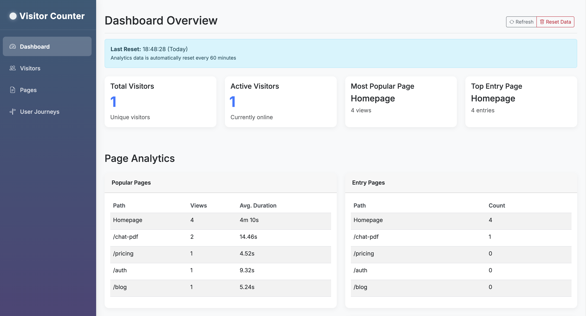

# Real-Time Visitor Counter Microservice

A real-time visitor counter microservice that can be easily integrated into any website. It tracks active visitors using Socket.io and Express.js.



## 🚀 Features

- **Real-Time Tracking**: Updates visitor count instantly
- **Easy Integration**: Add a single script to any website
- **Customizable Interface**: Color, position, text, and language options
- **Two-Way Communication**: Real-time updates via WebSockets
- **API Support**: Access visitor data through REST API
- **Docker Support**: Easy deployment with Docker integration
- **Analytics Dashboard**: Track visitor metrics
- **Detailed Analytics**: Track page views, entry/exit pages, popular pages, and user journeys
- **Swagger Documentation**: Interactive API documentation
- **Vercel Deployment Support**: Deploy easily on Vercel platform

## 🔧 Installation

### Docker Installation (Recommended)

```bash
# Clone the repository
git clone https://github.com/dogukanakinn/visitor-counter-microservice.git
cd visitor-counter-microservice

# Run with Docker
docker-compose up -d
```

### Manual Installation

```bash
# Clone the repository
git clone https://github.com/dogukanakinn/visitor-counter-microservice.git
cd visitor-counter-microservice

# Install dependencies
npm install

# Configure environment variables
cp .env.example .env

# Start in development mode
npm run dev

# or
# Build and start for production
npm run build
npm start
```

## 🧩 Integration with Your Website

The easiest way to integrate the Visitor Counter into your website is to add the following script:

### 1. Simple Integration (Easiest)

```html
<!-- Visitor Counter integration -->
<script src="https://visitors.yourdomain.com/client.js"></script>
```

### 2. Next.js Integration

For Next.js applications, you can use the Script component:

```jsx
import Script from 'next/script'

// In your component or layout:
<Script
  id="visitor-counter-script"
  strategy="afterInteractive"
  src={process.env.NEXT_PUBLIC_VISITOR_COUNTER_URL_PROD}
  data-debug={process.env.NODE_ENV === 'development' ? 'true' : 'false'}
/>
```

The `data-debug="true"` attribute enables debug mode, which is recommended for local development environments. This will print additional logs to the console to help with debugging.

You can also manually set it based on your environment:

```jsx
<Script
  id="visitor-counter-script"
  strategy="afterInteractive"
  src="https://visitors.yourdomain.com/client.js"
  data-debug="true"  // Set to "false" in production
  data-tracking-domain="https://visitors.yourdomain.com" // Optional: specify tracking domain
/>
```

### 3. Complete HTML Page Example

Here's a complete example of how to integrate the visitor counter into an HTML page:

```html
    <!-- Visitor Counter Script -->
    <script 
        src="https://visitors.yourdomain.com/client.js" 
        data-debug="true">
    </script>
```

In this example:
- We've included the visitor counter script at the bottom of the body
- We're using `data-debug="true"` which enables debug mode (should be removed in production)
- We've set the debug mode to automatically activate on localhost

## 📊 Analytics Dashboard

The service includes a built-in analytics dashboard that provides insights about your website traffic:

- **Overview**: Total visits, unique visitors, and real-time visitor count
- **Popular Pages**: Most visited pages on your site
- **Entry Pages**: Pages where visitors typically enter your site
- **Exit Pages**: Pages from which visitors leave your site
- **User Journeys**: Common paths users take through your site

Access the dashboard at:
```
https://visitors.yourdomain.com/dashboard
```

## 📚 API Reference

### Swagger Documentation

The API is fully documented using Swagger (OpenAPI). Once the server is running, you can access the interactive API documentation at:

```
http://localhost:5001/api-docs
```

This provides a user-friendly interface to:
- Browse all available API endpoints
- See request/response schemas
- Test API calls directly from the browser
- Download the OpenAPI specification

### WebSocket Events

The Visitor Counter service broadcasts the following events via WebSocket:

- `visitor-count`: Broadcasted when the visitor count changes
  ```js
  // Example data
  { count: 5 }
  ```

- `page-view`: Emitted by clients when a page is viewed
- `page-exit`: Emitted by clients when leaving a page

### REST API Endpoints

- `GET /api/visitors`: Returns the current visitor count
  ```json
  { "count": 5 }
  ```

- `GET /api/visitors/details`: Returns detailed information about connected visitors
  ```json
  {
    "count": 5,
    "clients": [
      {
        "id": "socket-id-1",
        "ip": "127.0.0.1",
        "connectionTime": "2023-03-26T12:30:45.123Z",
        "lastActive": "2023-03-26T12:35:45.123Z"
      },
      // ...
    ]
  }
  ```

#### Analytics API Endpoints

- `GET /api/analytics`: Get overview analytics
- `GET /api/analytics/pages`: Get page view statistics
- `GET /api/analytics/pages/popular`: Get most popular pages
- `GET /api/analytics/pages/entry`: Get most common entry pages
- `GET /api/analytics/pages/exit`: Get most common exit pages
- `GET /api/analytics/journeys`: Get user journey statistics
- `GET /api/analytics/clients`: Get client information

## 🚀 Deployment

### Recommended Services

- [Railway](https://railway.app)
- [Render](https://render.com)
- [DigitalOcean App Platform](https://www.digitalocean.com/products/app-platform/)
- [Heroku](https://heroku.com)
- [Vercel](https://vercel.com)
- Your own VPS or Server solutions

### Docker Deployment

```bash
# Build Docker image
docker build -t visitor-counter .

# Run the image
docker run -p 5001:5001 -e PORT=5001 -e ALLOWED_ORIGINS=https://yourwebsite.com visitor-counter
```

### Vercel Deployment Notes

When deploying to Vercel, keep in mind that Socket.IO on serverless platforms has some limitations:

1. Configure your `vercel.json` file:
```json
{
  "version": 2,
  "builds": [
    {
      "src": "src/index.ts",
      "use": "@vercel/node"
    }
  ],
  "routes": [
    {
      "src": "/socket.io/(.*)",
      "dest": "src/index.ts"
    },
    {
      "src": "/(.*)",
      "dest": "src/index.ts"
    }
  ]
}
```

2. For best performance on Vercel, configure the client to use polling only:
```html
<script 
  src="https://visitors.yourdomain.com/client.js" 
  data-transport="polling">
</script>
```

## 📄 Environment Variables

| Variable | Description | Default |
|----------|-------------|---------|
| PORT | Server port | 5001 |
| ALLOWED_ORIGINS | Comma-separated list of origins allowed to connect | http://localhost:3000 |
| ALLOWED_DOMAINS | Comma-separated list of domains allowed to use the service | studyaitool.com |
| LOCAL_URL | URL for local development | http://localhost:5001 |
| PRODUCTION_URL | URL for production deployment | - |

## 🔍 Troubleshooting

- **Connection issues**: Ensure your CORS settings in `.env` file include your website's domain
- **High CPU usage**: Check for memory leaks by monitoring the server logs
- **Socket.IO errors**: Make sure your client and server versions are compatible
- **Vercel deployment issues**: Socket.IO has limitations on serverless platforms - consider using only HTTP polling transport

👨‍💻 Developer: [Dogukan Akın](https://github.com/dogukanakinn)  

🔗 Linkedin: [Dogukan Akın](https://www.linkedin.com/in/dogukanakinn/)

🌐 Personal Website: [Dogukan Akın](https://dogukanakin.com)

📦 Project: [GitHub Repository](https://github.com/dogukanakinn/visitor-counter-microservice)

🛠️ This project is using [Studyaitool](https://studyaitool.com)